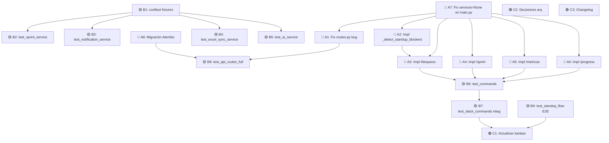

# Plan MVP Funcional — ScrumSlack-Bot

**Fecha:** 2026-06-15  
**Modelo planificación:** Claude Opus 4.6  
**Modelo ejecución:** Gemini 3.1 Pro  
**Proyecto:** `/Users/admin/Documents/projects/ScrumSlack-Bot/`

> [!IMPORTANT]
> Este plan contiene **17 tareas atómicas** organizadas en 3 fases. Cada tarea incluye el código actual, qué cambiar, y criterio de aceptación. Ejecutar en orden. No saltar tareas.

---

## Resumen del gap

| Categoría | Cantidad | Impacto |
|-----------|----------|---------|
| Slash commands stub | 4 | 🔴 Funcionalidad MVP rota |
| Lógica de negocio stub | 1 | 🔴 Detección de bloqueos no funciona |
| Bug en runtime | 1 | 🔴 API routes crashean |
| TODO sin resolver | 1 | 🟡 Multi-team no funciona |
| Migración Alembic vacía | 1 | 🟡 Deploy a prod imposible |
| Tests faltantes | 9 | 🟡 Sin cobertura de nuevas features |

---

## FASE A — Fixes de Código (Bloqueantes)

### A1. Fix bug en `routes.py` — llamadas `.to_domain()` redundantes

**Archivo:** `src/interfaces/api/routes.py`  
**Problema:** Los repositorios ya retornan objetos de dominio (dataclasses). Llamar `.to_domain()` sobre ellos causa `AttributeError` en runtime.

**Código actual (líneas 42, 53, 63, 73, 87):**
```python
# L42 — session ya es StandupSession (dataclass) o None
"session": session.to_domain() if session else None,

# L53 — risks ya son list[Risk] (dataclass)
"risks": [r.to_domain() for r in risks]

# L63 — prs ya son list[PullRequest] (dataclass)
"prs": [p.to_domain() for p in prs]

# L73 — members ya son list[Member] (dataclass)
"members": [m.to_domain() for m in members]

# L87 — latest ya es MetricSnapshot (dataclass) o None
"latest": latest.to_domain() if latest else None,
```

**Cambiar a:**
```python
# Serializar dataclasses a dict usando dataclasses.asdict() o __dict__
# Convertir UUIDs y datetimes a str para JSON

import dataclasses

def _serialize(obj):
    """Convierte dataclass de dominio a dict serializable."""
    if obj is None:
        return None
    d = dataclasses.asdict(obj)
    for k, v in d.items():
        if isinstance(v, UUID):
            d[k] = str(v)
        elif isinstance(v, (datetime, date)):
            d[k] = v.isoformat()
    return d
```

Luego reemplazar:
```python
"session": _serialize(session),
"risks": [_serialize(r) for r in risks],
"prs": [_serialize(p) for p in prs],
"members": [_serialize(m) for m in members],
"latest": _serialize(latest),
```

**Criterio de aceptación:** `GET /api/teams/{id}/risks` retorna JSON sin error. Todos los endpoints retornan dicts serializables.

---

### A2. Implementar `_detect_standup_blockers()` en `risk_service.py`

**Archivo:** `src/application/risk_service.py` (líneas 96-101)

**Código actual:**
```python
async def _detect_standup_blockers(self, team_id: UUID) -> list[Risk]:
    """Detecta bloqueos reportados en respuestas de standup recientes."""
    risks: list[Risk] = []
    # Implementación simplificada: iterar por todas las respuestas no es eficiente.
    # En una versión real se filtraría por sesión del día.
    return risks
```

**Dependencia necesaria:** El `RiskService` ya recibe `response_repo: StandupResponseRepository` en su `__init__` (L26-30). También necesita `StandupSessionRepository` para obtener la sesión del día.

**Opción recomendada — Agregar `session_repo` al constructor:**

1. Modificar `__init__` de `RiskService`:
```python
def __init__(
    self,
    risk_repo: RiskRepository,
    pr_repo: PullRequestRepository,
    response_repo: StandupResponseRepository,
    session_repo: StandupSessionRepository,  # NUEVO
):
    self._risk_repo = risk_repo
    self._pr_repo = pr_repo
    self._response_repo = response_repo
    self._session_repo = session_repo  # NUEVO
```

2. Implementar el método:
```python
async def _detect_standup_blockers(self, team_id: UUID) -> list[Risk]:
    """Detecta bloqueos reportados en respuestas de standup del día."""
    from datetime import date as date_type
    risks: list[Risk] = []
    today_session = await self._session_repo.get_today_session(team_id, date_type.today())
    if today_session is None:
        return risks
    responses = await self._response_repo.get_by_session(today_session.id)
    for resp in responses:
        if resp.blockers and resp.blockers.strip():
            risks.append(
                Risk(
                    team_id=team_id,
                    type=RiskType.BLOCKER,
                    description=f"Blocker reportado por miembro {resp.member_id}: {resp.blockers[:100]}",
                    severity=Severity.MEDIUM,
                    source_ref={
                        "session_id": str(today_session.id),
                        "member_id": str(resp.member_id),
                    },
                )
            )
    return risks
```

3. **Actualizar todas las instanciaciones de `RiskService`** en:
   - `src/main.py` L78 y L119 — agregar `session_repo=standup_repo` (la variable ya existe en scope)
   - `tests/unit/test_risk_service.py` — agregar fake `session_repo`

**Criterio de aceptación:** Si hay respuestas de standup del día con campo `blockers` no vacío, `detect_risks()` genera un `Risk` de tipo `BLOCKER` por cada una.

---

### A3. Implementar `/bloqueos` en `commands.py`

**Archivo:** `src/interfaces/slack/commands.py` (líneas 40-44)

**Código actual:**
```python
@app.command("/bloqueos")
async def handle_bloqueos_command(ack, say):
    await ack()
    text = "Comando /bloqueos: implementación pendiente de filtro por día."
    await say(text)
```

**Cambiar a:**
```python
@app.command("/bloqueos")
async def handle_bloqueos_command(ack, say):
    await ack()
    responses = await standup_service.get_today_responses(
        default_team_id, default_channel_id
    )
    blockers = [r for r in responses if r.blockers and r.blockers.strip()]
    if blockers:
        lines = [f"• {r.blockers}" for r in blockers]
        text = "🚫 *Bloqueos reportados hoy:*\n" + "\n".join(lines)
    else:
        text = "No hay bloqueos reportados hoy. ✅"
    await say(text)
```

**Criterio de aceptación:** `/bloqueos` muestra las respuestas del día que tienen campo `blockers` no vacío.

---

### A4. Implementar `/sprint` en `commands.py`

**Archivo:** `src/interfaces/slack/commands.py` (líneas 46-50)

**Dependencia:** Agregar `sprint_service` al dict de `services` extraído al inicio de `register_commands`. Esto requiere:
1. Agregar `sprint_service = services["sprint_service"]` en L15-19
2. Pasar `sprint_service` desde `main.py` en el dict `services` (L161-167)

**Código actual:**
```python
@app.command("/sprint")
async def handle_sprint_command(ack, say):
    await ack()
    text = "Comando /sprint: implementación pendiente."
    await say(text)
```

**Cambiar a:**
```python
@app.command("/sprint")
async def handle_sprint_command(ack, say):
    await ack()
    sprint = await sprint_service.get_active_sprint(default_team_id)
    if sprint:
        text = (
            f"🏃 *Sprint activo: {sprint.name}*\n"
            f"• Inicio: {sprint.start_date}\n"
            f"• Fin: {sprint.end_date}\n"
            f"• Estado: {sprint.status.value}\n"
            f"• Objetivos: {sprint.goals or 'Sin definir'}"
        )
    else:
        text = "No hay sprint activo actualmente."
    await say(text)
```

**Criterio de aceptación:** `/sprint` muestra info del sprint activo o mensaje de "no hay sprint".

---

### A5. Implementar `/metricas` en `commands.py`

**Archivo:** `src/interfaces/slack/commands.py` (líneas 52-56)

**Nota:** `sprint_service.get_sprint_metrics()` requiere `sprint_id`. Primero hay que obtener el sprint activo.

**Cambiar a:**
```python
@app.command("/metricas")
async def handle_metricas_command(ack, say):
    await ack()
    sprint = await sprint_service.get_active_sprint(default_team_id)
    if not sprint:
        await say("No hay sprint activo. Usa `/sprint` para verificar.")
        return
    metrics = await sprint_service.get_sprint_metrics(default_team_id, sprint.id)
    metric_list = metrics.get("metrics", [])
    if metric_list:
        lines = [f"• {m['type']}: {m['value']} ({m['date']})" for m in metric_list]
        text = f"📊 *Métricas del sprint {sprint.name}:*\n" + "\n".join(lines)
    else:
        text = f"📊 Sprint *{sprint.name}* activo pero sin métricas registradas aún."
    await say(text)
```

**Criterio de aceptación:** `/metricas` muestra métricas del sprint activo.

---

### A6. Implementar `/progreso` en `commands.py`

**Archivo:** `src/interfaces/slack/commands.py` (líneas 66-70)

**Dependencia:** Agregar `excel_service` al dict de `services` y extraerlo en `register_commands`.

**Cambiar a:**
```python
@app.command("/progreso")
async def handle_progreso_command(ack, say):
    await ack()
    try:
        modules = await excel_service.get_module_progress()
        if modules:
            lines = [
                f"• *{m.get('Módulo', 'N/A')}*: {m.get('% Avance', '0')}% — {m.get('Estado', 'N/A')}"
                for m in modules
            ]
            text = "📈 *Progreso de módulos:*\n" + "\n".join(lines)
        else:
            text = "No hay módulos registrados en la planilla."
    except FileNotFoundError:
        text = "⚠️ Planilla Excel no encontrada. Ejecuta la creación del template primero."
    await say(text)
```

**Criterio de aceptación:** `/progreso` lee la planilla Excel y muestra avance por módulo.

---

### A7. Resolver `services = None` en `main.py` (TAREA MÁS CRÍTICA)

**Archivo:** `src/main.py` (líneas 161-168)

**Problema:** Los servicios en el dict son `None`. Todos los slash commands crashean al intentar llamar métodos sobre `None`.

**Código actual:**
```python
services = {
    "standup_service": None,
    "report_service": None,
    "risk_service": None,
    "default_team_id": UUID("00000000-0000-0000-0000-000000000000"),
    "default_channel_id": settings.standup_channel_id,
}
register_handlers(slack_app, services)
```

**Solución:** Los handlers de Slack necesitan crear una sesión de DB por cada request. Refactorizar así:

1. En `commands.py`, los handlers deben obtener servicios vía factory en cada invocación
2. En `main.py`, pasar la `session_maker` y las factories de servicios en el dict:

```python
from src.infrastructure.database import get_async_session_maker

# Dentro del lifespan, después de init_db():
maker = get_async_session_maker()

services = {
    "session_maker": maker,
    "github_client": github_client,
    "default_team_id": UUID("00000000-0000-0000-0000-000000000000"),
    "default_channel_id": settings.standup_channel_id,
}
register_handlers(slack_app, services)
```

3. En `commands.py`, crear servicios frescos por request:

```python
def register_commands(app: AsyncApp, services: dict) -> None:
    maker = services["session_maker"]
    default_team_id = services.get("default_team_id")
    default_channel_id = services.get("default_channel_id")

    async def _get_services():
        session = maker()
        standup_svc = StandupService(
            session_repo=StandupSessionRepositoryImpl(session),
            response_repo=StandupResponseRepositoryImpl(session),
            member_repo=MemberRepositoryImpl(session),
        )
        # ... crear otros servicios
        return {"standup": standup_svc, ...}, session

    @app.command("/scrum")
    async def handle_scrum_command(ack, body, client):
        await ack()
        await client.views_open(
            trigger_id=body["trigger_id"],
            view=build_standup_modal(),
        )

    @app.command("/bloqueos")
    async def handle_bloqueos_command(ack, say):
        await ack()
        svcs, session = await _get_services()
        async with session:
            responses = await svcs["standup"].get_today_responses(
                default_team_id, default_channel_id
            )
            # ... rest of logic
            await session.commit()
```

> [!WARNING]
> Esta es la tarea más compleja y debe hacerse PRIMERO. Sin esto, las tareas A3-A6 no son probables en runtime. Aplicar el mismo patrón a `modals.py` y `events.py`.

**Criterio de aceptación:** Los slash commands `/scrum`, `/riesgos`, `/reporte` funcionan sin crash. Los servicios no son `None`.

---

### A8. Generar migración Alembic real

**Acción:**
```bash
# Borrar la migración vacía
rm migrations/versions/209717f6a27d_initial_schema.py

# Regenerar con autogenerate (requiere DB corriendo)
cd /Users/admin/Documents/projects/ScrumSlack-Bot
docker-compose up -d db
alembic revision --autogenerate -m "initial_schema"
alembic upgrade head
```

**Criterio de aceptación:** La migración contiene `op.create_table(...)` para las 9 tablas. `alembic upgrade head` crea todas las tablas. `alembic downgrade base` las elimina.

---

## FASE B — Tests Faltantes

### B1. `tests/conftest.py` — Fixtures compartidas

Crear fixtures reutilizables: `sample_team_id`, `sample_team`, `sample_member`, `sample_sprint`, `sample_standup_session`, `sample_standup_response`. Usar `uuid4()` y dataclasses de dominio.

### B2. `tests/unit/test_sprint_service.py`

6 tests: get_active retorna/none, create con PLANNING, complete cambia status, complete sin activo lanza error, get_metrics retorna dict.

### B3. `tests/unit/test_notification_service.py`

3 tests: reminder llama slack con blocks+botón, summary envía texto, notify_risk formatea por severity.

### B4. `tests/unit/test_excel_sync_service.py`

5 tests: template 5 hojas, headers correctos, sync escribe fila, get_module lee, update modifica. Usar `tmp_path`.

### B5. `tests/unit/test_ai_service.py`

4 tests: prompt contiene respuestas, retorna texto, empty lists OK, fallback en error.

### B6. `tests/unit/test_commands_implemented.py`

6 tests: bloqueos con/sin datos, sprint con/sin activo, metricas con datos, progreso con módulos.

### B7. `tests/integration/test_slack_commands.py`

Reemplazar placeholder. Simular payloads Slack con AsyncMock. Verificar ack+say+views_open.

### B8. `tests/integration/test_api_routes_full.py`

5 tests: cada endpoint GET retorna JSON correcto con datos vacíos (no crashea).

### B9. `tests/integration/test_standup_flow.py`

1 test E2E: crear team → members → submit respuestas → generar resumen → verificar contenido → cerrar sesión.

---

## FASE C — Docs

### C1. Actualizar `docs/02-kanban.md` — Corregir estados falsos
### C2. Crear `docs/04-decisiones-de-arquitectura.md`
### C3. Crear `docs/05-changelog.md`

---

## Orden de ejecución



---

## Prompt sugerido para Gemini

> Lee el archivo `docs/PLAN_MVP_FUNCIONAL.md`. Ejecuta **A7** primero (los servicios en `main.py` son `None` — todos los commands crashean). Luego **A1**, luego **A2-A6**, luego **A8**. Después pasa a Fase B tests. Al terminar cada tarea ejecuta `pytest tests/ -x -v` y reporta resultados.
