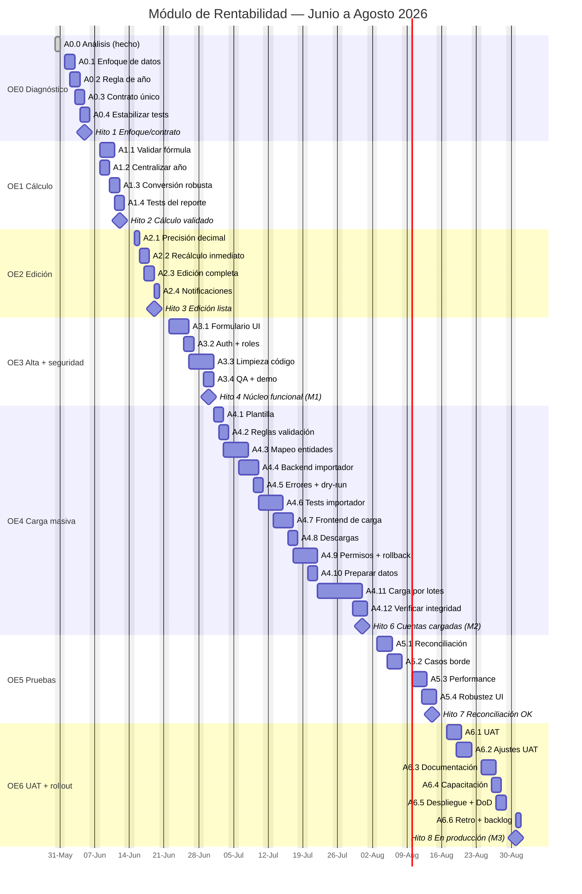

# Bitácora Completa — Módulo de Rentabilidad (Valuelist)

> Respaldo en Markdown del archivo `Bitacora-Rentabilidad-Valuelist.xlsx`.
> Replica las hojas: Bitácora · Gantt · Planificación · Administración · Evidencia.
> Horizonte: **Junio–Agosto 2026**. Responsable: **Emiliano Jofré**.
>
> ⚠️ **2026-06-14**: la tabla de Planificación (Hoja 3) se actualizó con el avance real
> (A0.4, A1.2, A1.3, A1.4, A2.1, A2.2, A2.4). El archivo `.xlsx` sigue en su versión previa
> (no editable acá) → **sincronizar manualmente el Excel** con estos % de logro.

---

## Hoja 1 — Bitácora

**Nombre del Proyecto:** Módulo de Rentabilidad — Valuelist

### Objetivo General (OG)
Dejar el módulo de rentabilidad de Valuelist terminado, funcional y validado: permitir
cargar los datos de las cuentas (de forma individual y masiva) de manera fácil, editarlos y
visualizarlos sin fricción, garantizar un cálculo de rentabilidad correcto y validado contra
fuentes reales, unificar el contrato entre el backend (valuelist-ruby) y el frontend
(valuelist-ng), reactivar la seguridad de los endpoints y dejar el módulo desplegado en
producción, todo en un horizonte de 3 meses.

### Objetivos Específicos

| OE | Descripción |
|----|-------------|
| **OE0** | Diagnóstico y decisiones: cerrar el enfoque de datos (snapshots manuales vs. cálculo desde wallet), definir un contrato único de respuesta del reporte, validar la regla de "año actual = año − 1" y dejar la suite de tests en verde como base. |
| **OE1** | Cálculo correcto: validar la fórmula de rentabilidad (absoluta y relativa) contra casos reales, centralizar la lógica de año, eliminar el fallback silencioso a 1.0 en la conversión de moneda y reescribir los tests del reporte. |
| **OE2** | Edición y visualización: corregir la pérdida de decimales en la edición, recalcular la rentabilidad de inmediato, permitir editar todos los campos relevantes con una clave estable mes↔registro y reemplazar los `alert()` por notificaciones de la app. |
| **OE3** | Alta individual y seguridad: construir el formulario de alta/edición de una cuenta por UI, reactivar autenticación y autorización por rol en el `ReportsController`, limpiar código muerto/legacy y realizar el QA del núcleo. |
| **OE4** | Carga masiva: definir la plantilla CSV/Excel y las reglas de validación, dedup e idempotencia; desarrollar el importador (backend y frontend con previsualización y reporte de errores) y cargar las cuentas faltantes. |
| **OE5** | Pruebas y reconciliación: reconciliar los reportes contra cartolas/fuentes oficiales, cubrir casos borde (multimoneda, meses parciales, FX faltante), validar performance con el dataset completo y endurecer la robustez de la UI. |
| **OE6** | UAT, documentación y puesta en producción: pruebas de usuario con asesores/supervisores, ajustes del feedback, documentación de uso y de la fórmula, capacitación, despliegue final y retrospectiva. |

### Milestones

| N° | Nombre | Descripción | Fecha |
|----|--------|-------------|-------|
| 1 | Enfoque y contrato definidos | Decisión de enfoque cerrada, contrato único definido, regla de año documentada y tests estabilizados. | 05-06-2026 |
| 2 | Cálculo validado | Fórmula validada contra casos reales, lógica de año centralizada, conversión sin fallback y tests del reporte verdes. | 12-06-2026 |
| 3 | Edición y visualización listas | Edición con precisión decimal, recálculo inmediato, edición completa de campos y notificaciones. | 19-06-2026 |
| 4 | **Núcleo funcional operativo (M1)** | Alta/edición por UI, contrato único, seguridad activa y tests verdes. Usable end-to-end para una cuenta. | 30-06-2026 |
| 5 | Importador operativo | Importador con plantilla, validación, preview y reporte de errores, probado en ambiente de pruebas. | 20-07-2026 |
| 6 | **Cuentas faltantes cargadas (M2)** | Cuentas preparadas, cargadas por lotes en producción y verificadas. | 31-07-2026 |
| 7 | Reconciliación y performance OK | Reportes reconciliados, casos borde cubiertos y performance validada con el dataset completo. | 14-08-2026 |
| 8 | **Módulo en producción (M3)** | UAT aprobado, ajustes aplicados, documentación y capacitación entregadas y módulo desplegado (DoD completo). | 31-08-2026 |

### Actividades por Objetivo Específico

**OE0 — Diagnóstico y decisiones**
| Cód | Nombre | Descripción |
|-----|--------|-------------|
| A0.0 | Análisis inicial del módulo | Revisión completa de backend y frontend; identificación de hallazgos y bloqueantes. *(Completado 30-05-2026)* |
| A0.1 | Decidir enfoque de datos | Snapshots manuales vs. cálculo desde wallet (decisión técnica + negocio). |
| A0.2 | Validar regla "año = año − 1" | Confirmar con negocio si mostrar el último año cerrado es intencional y documentarlo. |
| A0.3 | Definir contrato único y modelo | Contrato de respuesta del reporte y modelo definitivo (eliminar ambigüedad `accumulated` vs. `last_year`). |
| A0.4 | Estabilizar suite de tests | Reparar/estabilizar los tests existentes para tener base verde. |

**OE1 — Cálculo correcto**
| Cód | Nombre | Descripción |
|-----|--------|-------------|
| A1.1 | Validar fórmula de rentabilidad | Validar absoluta y relativa contra 2 casos reales conocidos. |
| A1.2 | Centralizar lógica de año | Eliminar el hardcode "año − 1" repetido en backend y frontend. |
| A1.3 | Conversión de moneda robusta | Eliminar fallback silencioso a 1.0; loguear/alertar FX faltantes. |
| A1.4 | Tests del command de reporte | Reescribir `report_for_sub_account_spec` para el contrato actual. |

**OE2 — Edición y visualización**
| Cód | Nombre | Descripción |
|-----|--------|-------------|
| A2.1 | Precisión decimal en edición | Reemplazar `parseInt` por manejo decimal. |
| A2.2 | Recálculo inmediato tras editar | Recalcular y refrescar la rentabilidad al guardar. |
| A2.3 | Edición completa + clave estable | Editar todos los campos y usar clave estable mes↔registro (no `period` string). |
| A2.4 | Notificaciones en vez de `alert()` | Usar el sistema de notificaciones de la app. |

**OE3 — Alta individual y seguridad**
| Cód | Nombre | Descripción |
|-----|--------|-------------|
| A3.1 | Formulario de alta/edición por UI | Crear/editar una `ProfitabilityAccount` con sus snapshots mensuales. |
| A3.2 | Auth + autorización por rol | Reactivar `authenticate_user!` y validar rol en el `ReportsController`. |
| A3.3 | Limpieza de código muerto/legacy | Eliminar emitters `accumulated` y componentes v1 sin uso. |
| A3.4 | QA interno + demo Fase 1 | Pruebas internas del núcleo y demostración de cierre (M1). |

**OE4 — Carga masiva**
| Cód | Nombre | Descripción |
|-----|--------|-------------|
| A4.1 | Definir plantilla CSV/Excel | Columnas, formatos, moneda, fechas y campos obligatorios. |
| A4.2 | Reglas validación/dedup/idempotencia | Reimportar no duplica. |
| A4.3 | Mapeo cuenta/subcuenta/moneda | Mapear entidades existentes. |
| A4.4 | Backend del importador | Servicio/endpoint con parseo y validación fila a fila. |
| A4.5 | Reporte de errores + dry-run | Reporte por fila y modo previsualización. |
| A4.6 | Tests del importador | Casos válidos, inválidos, duplicados y multimoneda. |
| A4.7 | Frontend de carga + preview | Subir archivo, previsualizar, ver errores y confirmar. |
| A4.8 | Descarga de plantilla y errores | Plantilla vacía y reporte de errores. |
| A4.9 | Permisos + rollback de lote | Restringir a roles y anular un lote. |
| A4.10 | Preparar/limpiar datos fuente | Datos de las cuentas faltantes listos. |
| A4.11 | Carga por lotes (pruebas→prod) | Cargar, corregir y subir a producción. |
| A4.12 | Verificación de integridad | Verificar datos post-carga (cierre M2). |

**OE5 — Pruebas y reconciliación**
| Cód | Nombre | Descripción |
|-----|--------|-------------|
| A5.1 | Reconciliación contra cartolas | Reconciliar reportes contra fuentes oficiales. |
| A5.2 | Casos borde | Multimoneda, meses parciales, FX faltante, saldos cero/negativos. |
| A5.3 | Performance con dataset completo | Validar con muchas subcuentas/meses. |
| A5.4 | Robustez de UI | Endurecer manejo de errores y estados vacíos. |

**OE6 — UAT, documentación y rollout**
| Cód | Nombre | Descripción |
|-----|--------|-------------|
| A6.1 | UAT con usuarios | Pruebas con asesores/supervisores y feedback. |
| A6.2 | Ajustes de UAT | Ajustes priorizados del feedback. |
| A6.3 | Documentación | Uso (cómo cargar/editar) y fórmula de cálculo. |
| A6.4 | Capacitación | Capacitar al equipo. |
| A6.5 | Despliegue final + DoD | Producción y checklist de Definición de Hecho (cierre M3). |
| A6.6 | Retro + backlog futuro | Retrospectiva y backlog de mejoras. |

---

## Hoja 2 — Gantt

**Código de colores (en el Excel):** 🟦 Objetivo específico · 🟨 Plazo esperado · 🟩 Realizado · 🟦 Plazo adelantado · 🟪 Plazo atrasado completado · 🟧 Hito/Milestone.

---

## Hoja 3 — Planificación

| Actividad | Descripción (resumen) | Responsable | Comienzo | Fin | % esp. | % logro | Entregable | Comentarios |
|-----------|-----------------------|-------------|----------|-----|:------:|:-------:|------------|-------------|
| **O0** | Diagnóstico y decisiones | Emiliano J. | 01-06 | 05-06 | | | | |
| A0.0 | Análisis inicial del módulo | Emiliano J. | 30-05 | 30-05 | 100% | 100% | 01-ANALISIS…md | Completado |
| A0.1 | Decidir enfoque de datos | Emiliano J. | 01-06 | 02-06 | 100% | 0% | Acta de decisión (ADR) | |
| A0.2 | Validar regla "año = año − 1" | Emiliano J. | 02-06 | 03-06 | 100% | 0% | Nota de decisión | |
| A0.3 | Definir contrato único y modelo | Emiliano J. | 03-06 | 04-06 | 100% | 0% | Especificación del contrato | |
| A0.4 | Estabilizar suite de tests | Emiliano J. | 04-06 | 14-06 | 100% | 60% | Suite en verde | Suite ya carga/corre; specs de rentabilidad verdes. Quedan 169 fallas preexistentes (raíz FX, T0.4) |
| **O1** | Cálculo correcto | Emiliano J. | 08-06 | 12-06 | | | | |
| A1.1 | Validar fórmula de rentabilidad | Emiliano J. | 08-06 | 10-06 | 100% | 0% | Planilla de validación | |
| A1.2 | Centralizar lógica de año | Emiliano J. | 08-06 | 14-06 | 100% | 100% | Refactor + test | `reference_year`. Falta D2 (validación negocio) |
| A1.3 | Conversión de moneda robusta | Emiliano J. | 10-06 | 14-06 | 100% | 100% | Servicio + alertas | `MissingRateError`, sin fallback 1.0. Falta rescate en UI (A5.2) |
| A1.4 | Tests del command de reporte | Emiliano J. | 11-06 | 14-06 | 100% | 100% | Specs verdes | Reescrito al contrato actual |
| **O2** | Edición y visualización | Emiliano J. | 15-06 | 19-06 | | | | |
| A2.1 | Precisión decimal en edición | Emiliano J. | 15-06 | 14-06 | 100% | 100% | Edición con decimales | `parseInt`→`unformat`. Falta smoke test visual |
| A2.2 | Recálculo inmediato tras editar | Emiliano J. | 16-06 | 14-06 | 100% | 100% | UI con recálculo | `@Output dataUpdated`→refetch. Verificado con `ng build` |
| A2.3 | Edición completa + clave estable | Emiliano J. | 17-06 | 18-06 | 100% | 0% | Endpoint + UI | |
| A2.4 | Notificaciones en vez de alert() | Emiliano J. | 19-06 | 14-06 | 100% | 100% | UI con notificaciones | `MatSnackBar`. Falta smoke test visual |
| **O3** | Alta individual y seguridad | Emiliano J. | 22-06 | 30-06 | | | | |
| A3.1 | Formulario de alta/edición por UI | Emiliano J. | 22-06 | 25-06 | 100% | 0% | Formulario funcional | |
| A3.2 | Auth + autorización por rol | Emiliano J. | 25-06 | 26-06 | 100% | 0% | Endpoints protegidos | |
| A3.3 | Limpieza de código muerto/legacy | Emiliano J. | 26-06 | 29-06 | 100% | 0% | Código limpio | |
| A3.4 | QA interno + demo Fase 1 | Emiliano J. | 29-06 | 30-06 | 100% | 0% | Acta de demo | Cierre M1 |
| **O4** | Carga masiva de cuentas | Emiliano J. | 01-07 | 31-07 | | | | |
| A4.1 | Definir plantilla CSV/Excel | Emiliano J. | 01-07 | 02-07 | 100% | 0% | Plantilla definida | |
| A4.2 | Reglas validación/dedup/idempotencia | Emiliano J. | 02-07 | 03-07 | 100% | 0% | Especificación | |
| A4.3 | Mapeo cuenta/subcuenta/moneda | Emiliano J. | 03-07 | 06-07 | 100% | 0% | Mapa de datos | |
| A4.4 | Backend del importador | Emiliano J. | 06-07 | 09-07 | 100% | 0% | Importador backend | |
| A4.5 | Reporte de errores + dry-run | Emiliano J. | 09-07 | 10-07 | 100% | 0% | Preview + reporte | |
| A4.6 | Tests del importador | Emiliano J. | 10-07 | 13-07 | 100% | 0% | Tests verdes | |
| A4.7 | Frontend de carga + preview | Emiliano J. | 13-07 | 16-07 | 100% | 0% | Pantalla de carga | |
| A4.8 | Descarga de plantilla y errores | Emiliano J. | 16-07 | 17-07 | 100% | 0% | Descargas | |
| A4.9 | Permisos + rollback de lote | Emiliano J. | 17-07 | 20-07 | 100% | 0% | Permisos + rollback | |
| A4.10 | Preparar/limpiar datos fuente | Emiliano J. | 20-07 | 22-07 | 100% | 0% | Datos listos | |
| A4.11 | Carga por lotes (pruebas→prod) | Emiliano J. | 22-07 | 29-07 | 100% | 0% | Cuentas cargadas | |
| A4.12 | Verificación de integridad | Emiliano J. | 29-07 | 31-07 | 100% | 0% | Reporte de verificación | Cierre M2 |
| **O5** | Pruebas y reconciliación | Emiliano J. | 03-08 | 14-08 | | | | |
| A5.1 | Reconciliación contra cartolas | Emiliano J. | 03-08 | 05-08 | 100% | 0% | Planilla de reconciliación | |
| A5.2 | Casos borde | Emiliano J. | 05-08 | 07-08 | 100% | 0% | Casos cubiertos | |
| A5.3 | Performance con dataset completo | Emiliano J. | 10-08 | 12-08 | 100% | 0% | Reporte de performance | |
| A5.4 | Robustez de UI | Emiliano J. | 12-08 | 14-08 | 100% | 0% | UI robusta | |
| **O6** | UAT, documentación y rollout | Emiliano J. | 17-08 | 31-08 | | | | |
| A6.1 | UAT con usuarios | Emiliano J. | 17-08 | 19-08 | 100% | 0% | Feedback de UAT | |
| A6.2 | Ajustes de UAT | Emiliano J. | 19-08 | 21-08 | 100% | 0% | Ajustes aplicados | |
| A6.3 | Documentación | Emiliano J. | 24-08 | 26-08 | 100% | 0% | Documentación | |
| A6.4 | Capacitación | Emiliano J. | 26-08 | 27-08 | 100% | 0% | Sesión de capacitación | |
| A6.5 | Despliegue final + DoD | Emiliano J. | 27-08 | 28-08 | 100% | 0% | Release en producción | Cierre M3 |
| A6.6 | Retro + backlog futuro | Emiliano J. | 31-08 | 31-08 | 100% | 0% | Acta de retro + backlog | |

---

## Hoja 4 — Administración

| Actividad | Descripción | Responsable | Comienzo | Fin | % Logro | Comentarios |
|-----------|-------------|-------------|----------|-----|:-------:|-------------|
| AD1 | Entrega del análisis y planificación inicial | Equipo | 30-05 | 30-05 | 100% | Documentos en docs-rentabilidad/ |
| AD2 | Demo de cierre Fase 1 (núcleo funcional) | Emiliano J. | 30-06 | 30-06 | 0% | Hito M1 |
| AD3 | Demo de cierre Fase 2 (cuentas cargadas) | Emiliano J. | 31-07 | 31-07 | 0% | Hito M2 |
| AD4 | Entrega de documentación y capacitación | Emiliano J. | 24-08 | 27-08 | 0% | Manual + fórmula |
| AD5 | Despliegue a producción y cierre | Emiliano J. | 31-08 | 31-08 | 0% | Hito M3 / DoD |

---

## Hoja 5 — Evidencia

| Actividad | Descripción | Enlace / Ubicación |
|-----------|-------------|--------------------|
| A0.0 | Análisis del módulo | `docs-rentabilidad/01-ANALISIS-RENTABILIDAD.md` |
| OE0–OE6 | Planificación y carta Gantt | `docs-rentabilidad/02-PLANIFICACION-Y-GANTT.md` |
| Bitácora | Registro vivo de avance | `docs-rentabilidad/03-BITACORA-RENTABILIDAD.md` |
| Bitácora (xlsx) | Este archivo | `docs-rentabilidad/Bitacora-Rentabilidad-Valuelist.xlsx` |
| Repositorio | Código fuente | _(agregar enlace de repo)_ |
| A0.4/A1.2/A1.3/A1.4 | Backend (specs + refactor + fix FX) | `valuelist-ruby` rama `feature/rentabilidad-estabilizacion` (6 commits, 38 specs verdes) |
| A2.1/A2.2/A2.4 | Frontend (decimales, recálculo, snackbar) | `valuelist-ng` rama `feature/rentabilidad-frontend-decimales` (3 commits, `ng build` OK) |
